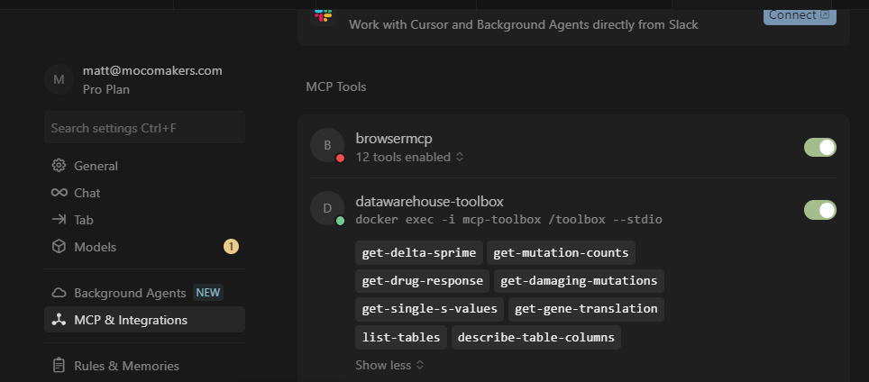

# MCP (Model Context Protocol) Integration Guide

## 🎯 **Overview**

This guide covers the MCP (Model Context Protocol) integration for database introspection and data warehouse exploration. MCP provides a standardized way to interact with your PostgreSQL database through Cursor IDE, enabling powerful data analysis and exploration capabilities.

## ** Warnings!!! **
Note, many MCP tools are MALICIOUS - and will steal database credentials. Only use READ-ONLY database accounts (e.g. `compbio_dw_readonly`) with MCP tools, and only use trusted tools. We are using a trusted Google product as our MCP backend - [https://github.com/googleapis/genai-toolbox](https://github.com/googleapis/genai-toolbox)

## 🛠️ **Prerequisites**

### **Required Software**
1. **Cursor IDE** - Download from [cursor.sh](https://cursor.sh)
2. **Docker & Docker Compose** - [Install Docker](https://docs.docker.com/get-docker/)
3. **Git** - [Download Git](https://git-scm.com/downloads)
4. **Python 3.9+** - [Download Python](https://www.python.org/downloads/)

## 🔧 **MCP Toolbox Setup**
### **Database Configuration**
1. **Copy Configuration Template**:
   ```bash
   # Copy the example configuration file
   cp tools.yaml.example tools.yaml
   ```

2. **Update Database Credentials**:
   Edit `tools.yaml` with your actual database connection details:
   ```yaml
   sources:
     postgres-readonly:
       kind: postgres
       host: your-remote-postgres-host.com  # Replace with your remote PostgreSQL host
       port: 5432
       database: data_warehouse              # Replace with your database name
       user: compbio_dw_readonly            # Replace with your database user
       password: PASSWORD_HERE              # Replace with your actual password
   ```

   #### **Test Database Connection**
Before continuing, it is strongly advised to test your Postgres credentials in pgAdmin or a similar GUI first, before troubleshooting testing connections with the MCP.

### **3. Launch MCP Toolbox**

```bash
# Pull the latest MCP Toolbox image
docker pull us-central1-docker.pkg.dev/database-toolbox/toolbox/toolbox:latest

# Create named MCP Toolbox container with HTTP mode
docker run -d --name mcp-toolbox -p 5000:5000 -v ./tools.yaml:/app/tools.yaml us-central1-docker.pkg.dev/database-toolbox/toolbox/toolbox:latest --tools-file /app/tools.yaml

# Verify MCP Toolbox container is running
docker ps | grep mcp-toolbox
```

## 🎯 **Cursor IDE Configuration**

### **1. Install Cursor IDE**
```bash
# Download from https://cursor.sh
# Follow installation instructions for your OS
```

### **2. Configure MCP in Cursor**
1. Open Cursor Settings (Ctrl+,)
2. Search for "MCP"
3. Add MCP server configuration:

```json
{
  "mcpServers": {
    "datawarehouse-toolbox": {
      "command": "docker",
      "args": ["exec", "-i", "mcp-toolbox", "/toolbox", "--stdio"]
    }
  }
}
```

### **3. Restart Cursor IDE**
After adding the MCP configuration, restart Cursor to establish the connection.

## ✅ **Verify MCP Connection**

After restarting Cursor, you should see the MCP server connected successfully in the settings:


*Note: Place the `successful_mcp.png` screenshot in the project root directory*

**What you should see:**
- ✅ **datawarehouse-toolbox** with a green status dot
- ✅ **8 tools enabled** showing all your database tools:
  - `get-delta-sprime`
  - `get-mutation-counts` 
  - `get-drug-response`
  - `get-damaging-mutations`
  - `get-single-s-values`
  - `get-gene-translation`
  - `list-tables`
  - `describe-table-columns`
- ✅ **Green toggle switch** indicating the MCP is active

## 🎯 **Sample MCP Prompts**

Once your MCP connection is established, you can use these sample prompts in Cursor to explore your database:

### **Database Exploration**
```
Use the MCP Tool to list all tables in the database and show me the structure of the main DepMap tables
```

```
Describe the columns and data types for the im_dep_raw_secondary_dose_curve table
```

```
Show me the schema for the fnl_sprime_pooled_delta_sprime table and explain what each column represents
```

### **Data Analysis Queries**
```
Use the MCP Tool to get drug response data for the top 10 most effective drugs based on AUC values
```

```
Get mutation counts for cell lines that have high sensitivity scores in the delta S prime results
```

```
Show me the gene translation data for genes with significant delta S prime values (p < 0.05)
```

### **Performance Testing**
```
Use the MCP Tool to get a sample of 1000 rows from the dose response curve data to test query performance
```

```
Get damaging mutations data for a specific gene ID and show me the mutation patterns
```

### **Migration Validation**
```
Compare the data structure between the old CSV files and the new database tables using MCP tools
```

```
Verify that all expected columns from the original DepMap CSV are present in the database schema
```

### **Advanced Queries**
```
Use MCP tools to find drugs with both high AUC and low EC50 values, indicating high potency and effectiveness
```

```
Get the pooled delta S prime values for genes that show significant differences between reference and test conditions
```

### **Troubleshooting**
```
Use MCP tools to check if the database connection is working and list all available tables
```

```
Test the MCP Tool connection by getting a small sample of data from each major table
```

## 🐳 **MCP Toolbox Management**

### **Management Scripts**
We provide convenient scripts to manage the MCP Toolbox container:

**Linux/macOS:**
```bash
# Make script executable
chmod +x scripts/mcp-toolbox.sh

# Start MCP Toolbox
./scripts/mcp-toolbox.sh start

# Check status
./scripts/mcp-toolbox.sh status

# View logs
./scripts/mcp-toolbox.sh logs

# Restart if needed
./scripts/mcp-toolbox.sh restart
```

**Windows:**
```cmd
# Start MCP Toolbox
scripts\mcp-toolbox.bat start

# Check status
scripts\mcp-toolbox.bat status

# View logs
scripts\mcp-toolbox.bat logs

# Restart if needed
scripts\mcp-toolbox.bat restart
```

## 🚨 **Troubleshooting**

### **Common Issues**

1. **MCP Toolbox Connection Failed**:
   ```bash
   # Check if MCP Toolbox container is running
   docker ps | grep mcp-toolbox
   
   # Check logs
   docker logs mcp-toolbox
   
   # Restart MCP Toolbox
   docker stop mcp-toolbox
   docker rm mcp-toolbox
   docker run -d --name mcp-toolbox -p 5000:5000 -v ./tools.yaml:/app/tools.yaml us-central1-docker.pkg.dev/database-toolbox/toolbox/toolbox:latest --tools-file /app/tools.yaml
   ```

2. **Database Connection Issues**:
   ```bash
   # Test remote database connection
   psql -h your-remote-postgres-host.com -U compbio_dw_readonly -d data_warehouse -c "SELECT 1;"
   
   # Check tools.yaml configuration
   cat tools.yaml
   ```

3. **MCP Toolbox Health Check**:
   ```bash
   # Check container status
   docker ps | grep mcp-toolbox
   
   # Check container logs
   docker logs mcp-toolbox
   ```

4. **Cursor MCP Extension Issues**:
   - Restart Cursor IDE
   - Check MCP server configuration in settings
   - Verify Docker containers are running

### **Performance Monitoring**
```bash
# Monitor MCP Toolbox container
docker ps | grep mcp-toolbox
docker logs mcp-toolbox

# Monitor container resource usage
docker stats mcp-toolbox

# Check container health
docker inspect mcp-toolbox --format='{{.State.Health.Status}}'
```

## 📊 **Available Database Tables**

The MCP Toolbox provides access to the following database tables:

1. **`fnl_sprime_pooled_delta_sprime`** - Final pooled delta S' results
2. **`im_dep_raw_secondary_dose_curve`** - Raw DepMap dose-response data
3. **`im_dep_sprime_damaging_mutations`** - DepMap damaging mutations
4. **`im_omics_genes`** - Gene information
5. **`im_sprime_solved_s_prime`** - Solved S' values
6. **`im_sprime_s_prime_with_mutations`** - S' values with mutations
7. **`im_dep_sprime_damaging_mutations_temp`** - Temporary mutations table
8. **`fnl_sprime_pooled_delta_sprime_temp`** - Temporary delta S' table

## 🔗 **Integration with Streamlit**

The MCP Toolbox runs in parallel to your Streamlit application, providing database introspection capabilities while your Streamlit app connects directly to PostgreSQL for data display.

### **Architecture**
```
┌─────────────────┐    ┌──────────────────┐    ┌─────────────────┐
│   Streamlit UI  │    │   MCP Toolbox    │    │   PostgreSQL    │
│                 │◄──►│   (Docker)       │◄──►│   Database      │
│ - Direct DB     │    │ - Tool Registry  │    │ - Optimized     │
│ - Fast Loading  │    │ - Query Engine   │    │ - Indexed       │
└─────────────────┘    └──────────────────┘    └─────────────────┘
```

## 📚 **Additional Resources**

- **[MCP Toolbox Documentation](https://github.com/googleapis/genai-toolbox)** - Official MCP Toolbox documentation
- **[Cursor IDE Documentation](https://cursor.sh/docs)** - Cursor IDE setup and usage guide
- **[PostgreSQL Documentation](https://www.postgresql.org/docs/)** - Database setup and optimization
- **[MIGRATION_STRATEGY.md](MIGRATION_STRATEGY.md)** - Detailed migration plan and technical specifications
