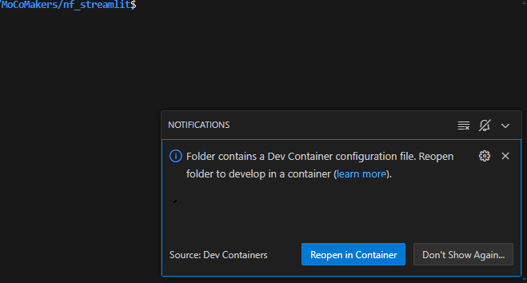

# Get the Paper:
See the source paper (Open Access):
[https://www.ncbi.nlm.nih.gov/pmc/articles/PMC10742026/](https://www.ncbi.nlm.nih.gov/pmc/articles/PMC10742026/)

Zamora PO, Altay G, Santamaria U, Dwarshuis N, Donthi H, Moon CI, Bakalar D, Zamora M. Drug Responses in Plexiform Neurofibroma Type I (PNF1) Cell Lines Using High-Throughput Data and Combined Effectiveness and Potency. Cancers (Basel). 2023 Dec 12;15(24):5811. doi: 10.3390/cancers15245811. PMID: 38136356; PMCID: PMC10742026.

See the deployed version of this code at: [https://nf.mocomakers.com](https://nf.mocomakers.com)

## See the poster
[https://www.mocomakers.com/wp-content/uploads/2023/06/qHTS-NF1-Drugs-List-PosterV8-Final.pdf](https://www.mocomakers.com/wp-content/uploads/2023/06/qHTS-NF1-Drugs-List-PosterV8-Final.pdf)

# About this project:
This code hosts a web tool (DREA web tool) for exploring NF1 quantitative High Throughput Screening (qHTS) data.

Please visit this tool live here:
[http://nf.mocomakers.com](http://nf.mocomakers.com) - Use the Sign Up form on the page, and if there is an issue please contact matt@mocomakers.com

A sister repo to this project is: [https://github.com/MoCoMakers/hack4nf-2022](https://github.com/MoCoMakers/hack4nf-2022)

# Getting Started
## Local Development (Developers Only)
### Quick Start with `devcontainers`
You can setup the project on your browser using your GitHub account by clicking [this Codespaces deeplink](https://codespaces.new/MoCoMakers/nf_streamlit/tree/developer%2Fenvironment).<br/>

Alternatively, install and setup the software listed in the [Tech Stack section](#tech-stack) on your computer. Then take the following steps:

Using a bash terminal, clone the repository:
```bash
git clone https://github.com/MoCoMakers/nf_streamlit.git
```
Go into the cloned folder:
```bash
cd nf_streamlit
```
Open the project with Visual Studio code:
```bash
code .
```
While the project is loading in the editor, watch out for a prompt with a button asking you to "Reopen in Container":



Click the "Reopen in Container" button and the project would be opened in Devcontainers with the database running in the background.


> #### **Run the project after setup**
> After setting up the project following the instructions above, you can run the project following the following steps:
> - Make copies of the templates of configuration files ending with the extension `.example` and rename them:
>> ```bash
>> find . -name '*.example' -type f -exec bash -c 'cp "$1"  ${1%.example} ' -- {} \;
>> ```
> - To run the streamlit server, use the following command (preferably in a new terminal that you can open by using the ``CONTROL + SHIFT + ` ``):
>> ```bash
>> streamlit run Home.py --server.fileWatcherType auto --server.headless true
>> ```

### Local setup without `devcontainers`
Clone repo, then copy `config.toml.example` to `config.toml`, and `secrets.toml.example` to `secrets.toml` and update the values.
Note that you will need a remote database connection (MySQL is the default) configured with a users table, for example:

table drea_users;
```
+--------------+--------------+------+-----+---------+-------+
| Field        | Type         | Null | Key | Default | Extra |
+--------------+--------------+------+-----+---------+-------+
| username     | varchar(255) | NO   | PRI | NULL    |       |
| email        | text         | YES  |     | NULL    |       |
| name         | text         | YES  |     | NULL    |       |
| passwordhash | text         | YES  |     | NULL    |       |
| approved     | tinyint(1)   | YES  |     | NULL    |       |
+--------------+--------------+------+-----+---------+-------+
```


### Get the data

Put all of the data inside the folder named `app/data`.

#### Synapse data (MIPE 3.0)
<br>You will need a valid synapse.org account and approved
<br>access (portal request) to [syn5522627](https://www.synapse.org/#!Synapse:syn5522627) - which you can search for on synapse.org

Run the following inside the `app/data` folder

```
pip install synapseclient[pandas,pysftp]
mkdir syn5522627
cd syn5522627
synapse get -r syn5522627
```

#### Dep Map data

Download here (if the direct link doesn't work, navigate to Downloads > File Downloads and continue):

https://depmap.org/portal/download/all/ -> Drug Screens -> PRISM Repurposing 19Q4

Download the file:

| File | Date | Size | 
| -------- | ------- | ------- |
| secondary-screen-dose-response-curve-parameters.csv | 07/19 | 39.3 MB |

Save your csv file in `app/data/DepMap/Prism19Q4/`

And also download the latest mutation data from Downloads -> -> Current Release \(tab\) -> Mutations \(tab\) -> OmicsSomaticMutationsMatrixDamaging.csv 

Save your csv file in `app/data/DepMap/Public24Q4/`

### Install depdencies and run

Change to `app/` directory<br>
Install Python requirements `pip install -r requirements.txt`<br>
Start the app on Windows `streamlit run .\Home.py`<br>
Start the app Linux/MacOS `streamlit run ./Home.py`

Note that on first run, you may need to do a page reload two times before the site displays a consistant view, or stable error message.

## Deploying to a server

Log into the server<br>
Clone the docker repo, and change into it:<br>
[https://github.com/MocoMakers/docker_streamlit](https://github.com/MocoMakers/docker_streamlit)
<br><br>
Run the command in the docker repo:
```
docker build . -t streamlit_app
```
<br>
Clone this repo.<br>

Copy `app/.streamlit/config.toml.example` to be just `config.toml`.<br>
Copy `app/.streamlit/secrets.toml.example` to be just `secrets.toml` and fill in the desired password.

Then run:<br>
```
docker run -p 8501:8501 -v ~/nf_streamlit/app:/app streamlit_app
```
<br>
The first command only needs to be run one time. To run the server using the second command, chaging `~/docker_streamlit/app` for the location of the `app` directory in this repo.


## **Tech Stack**
This project uses the following technologies:
- Visual Studio <small>([download here](https://visualstudio.microsoft.com/downloads/))</small> or similar editor like GitHub's Codespaces <small>([check out here](https://github.com/codespaces) or [try out this codebase here](https://codespaces.new/MoCoMakers/nf_streamlit/tree/developer%2Fenvironment))</small>
- Git <small>([download here](https://git-scm.com/book/en/v2/Getting-Started-Installing-Git))</small>
- Docker <small>([install](https://docs.docker.com/get-docker/) along with [`docker-compose` plugin](https://docs.docker.com/compose/install/))</small>
    - Streamlit <small>([Custom container](https://github.com/MoCoMakers/nf_streamlit/blob/developer/environment/.devcontainer/Dockerfile) built from [Python base](https://hub.docker.com/_/python))</small>
    - MySQL <small>([official image](https://hub.docker.com/_/mysql))</small>

# Troubleshooting for Mac users
If you face errors upon running the `pip install -r requirements.txt`, the following [link](https://stackoverflow.com/questions/76876823/cannot-install-mysqlclient-on-macos) may be of help.